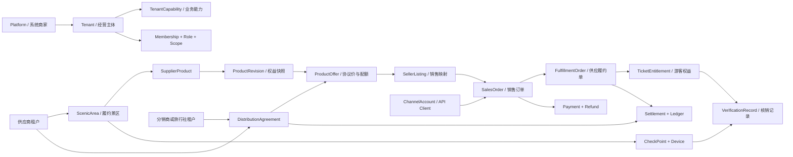

# 多租户景区票务平台开发基线与演进指南

> **当前审查状态（2026-08-02）**：代码级 P0/P1 已完成一轮闭环并进入自动化，schema 版本为 63，生产数据库已迁移到 PostgreSQL；当前生产阻断项已收敛为真实支付、真实硬件、真实渠道协议、部署恢复演练及现场容量/长稳验收。旧库导入不是新系统发布门槛，仅在以后明确提出时作为独立项目处理。当前执行状态以[当前开发推进路线](./current-development-roadmap-2026-08-01.md)和[现场联调准备清单](./field-integration-readiness-checklist.md)为准。

- 文档状态：后续开发的架构与验收基线
- 审计日期：2026-07-31
- 当前主线：`main`
- 历史审计基线：`ed0e794`；审计后的修复已分批合入主线
- 适用范围：平台管理端、景区供应商、分销商、旅行社、窗口售票、检票设备、OTA、支付与结算
- 配套文档：[景区票务经营系统产品研究与当前项目差距](./scenic-ticketing-product-research.md)

## 1. 如何使用本文档

本文档用于防止后续开发在长对话、多人协作或功能追加过程中遗失已经确认的业务边界。开始涉及租户、商品、订单、库存、票、核销、分销、渠道、支付或资金的开发前，必须先阅读本文档。

本文档包含三类内容：

- **当前事实**：当前仓库已经存在的代码和已经确认的问题。
- **目标规则**：后续实现必须满足的领域边界和数据不变量。
- **实施顺序**：在不重复推翻数据模型的前提下，建议采用的开发阶段和验收门槛。

若当前代码与本文档冲突，当前代码代表“现状”，本文档代表“目标”。修复冲突时必须增加迁移和回归测试，不能直接修改数据含义。

本文档不是最终现场需求。设备协议、旅行社合同、财务规则和实际岗位流程仍需现场确认。新的业务决策应直接更新本文档的“已确认决策”和“待确认事项”，不要只保留在聊天记录中。

## 2. 产品目标与角色边界

目标不是复刻智游宝，而是建设一套更适合本景区及合作伙伴日常经营的票务平台。

### 2.1 系统商家（平台方）

系统商家负责平台治理，不等同于任何一个景区租户：

- 租户开户、资质审批、能力开通、冻结、清退和数据保留。
- 平台用户、平台角色、跨租户支持授权和完整审计。
- 全平台渠道、异常、风险、结算和运行状态监控。
- 在有理由、有授权、有日志的情况下进入指定租户视角处理问题。
- 不能通过普通租户接口隐式获得跨租户数据。

### 2.2 景区供应商

景区供应商是租户，也是票务产品和履约能力的所有者：

- 管理自己的景区、产品、票规、价格、库存、检票点、闸机、员工和支付配置。
- 通过窗口、自己的线上渠道或平台内渠道直销。
- 决定哪些产品可授权给哪些分销商、旅行社或渠道。
- 管理协议价、配额、销售期、退改规则和结算条件。
- 查看并处理所有由本景区履约的订单、游客权益、核销、售后和应收。

### 2.3 分销商

分销商是独立租户，是销售方但通常不是景区履约方：

- 与一个或多个供应商建立合作协议。
- 接入供应商授权的产品，配置自己的零售价和展示信息。
- 通过外部 OTA、自有渠道以及未来的平台小程序或 H5 销售。
- 查看自己的销售订单、客户、渠道、毛利、应付和结算。
- 不能修改供应商产品来源、履约规则、结算底价或景区库存归属。

### 2.4 旅行社

旅行社可拥有普通分销能力，但团队业务必须独立建模：

- 管理合同、协议价、授信、预付款、业务员、导游、车辆和团队计划。
- 支持名单导入、人数变更、分批入园、挂账和周期结算。
- 不能仅用普通订单加一个团号字段代替团队业务。

### 2.5 允许组合能力

同一主体未来可能同时经营景区、分销其他景区产品或开展旅行社业务。因此不要只设置一个互斥的 `tenant_type`。推荐采用：

- `Tenant`：组织主体。
- `TenantCapability`：`supplier`、`distributor`、`travel_agency` 等可组合能力。
- 每项能力独立保存申请状态、审批状态、资质、有效期和停用原因。

### 2.5 硬边界与现场灵活性

系统的目标是降低现场操作成本，不是把每个岗位流程做成只能走一条路径。设计时必须区分两类规则：

- **硬边界**：租户/景区隔离、票权益归属、库存和金额事实、支付回调幂等、结算来源以及权限范围不可被现场操作绕过。
- **可调整流程**：收银员补录备注、主管代关班/复核差异、退款或作废的业务原因、结算争议和人工复核可以按岗位授权执行，并记录操作人、时间、原因和关联单据。

任何“灵活处理”都应追加事实或审计记录，而不是直接覆盖原始支付、出票、核销或结算事实；不应为了追求 fail-closed 而阻断有授权、有依据且可追溯的现场纠错。

## 3. 当前项目完成度

> **实现复核（2026-08-02）**：数据库迁移当前版本为 60。平台治理工作台、供应商 Listing 状态同步、跨供应商组合产品、游客快照归属、POS 收银闭环、按原支付来源分摊的混合退款、供应履约详情、销售订单多供应商责任视图、上下游结算工作台、按票售后、旅行社团队履约闭环以及营业/核销四张正式报表已进入主线。团队入园由供应商设备执行并校验已支付票权益；确认单、临时人数变更、分批入园、争议调整、双方结算和关系级资金汇总均保留审计。这些改动改善了运营可见性，但不改变真实支付、渠道、硬件、双方现场制度和生产验收仍是准入门槛的结论。当前实施顺序见[当前开发推进路线](./current-development-roadmap-2026-08-01.md)。

当前项目已经形成“单景区票务核心 + 多租户边界 + 供应履约/分销/团队基础”，但尚未形成经过真实支付、硬件和现场流程验收的多主体生产闭环。

| 领域 | 估算完成度 | 当前判断 |
|---|---:|---|
| 系统商家平台治理 | 30% | 独立平台身份、租户状态/能力和审计已具备；全局运营、代管审批仍待完成 |
| 景区供应商直营 | 60% | 产品版本、票权益、库存、退款和服务端开班/交班基础已成形；真实设备仍待联调 |
| 租户隔离 | 60% | 供应履约景区、平台作用域、渠道作用域和团队租户负向测试已覆盖；数据库复合外键仍待加强 |
| 供应商到分销商闭环 | 55% | 报价、销售映射、履约单、票权益、整数分账本和结算单基础已落地 |
| OTA 与外部渠道 | 45% | 独立渠道账号、正文签名、映射和请求冲突保护已落地；具体 OTA 适配器和账单对账仍待联调 |
| 支付、退款与结算 | 50% | 回调、幂等查单补偿、现金退款、数字退款待确认任务、产品履约结算快照已接入 |
| 旅行社团队业务 | 70% | 合同、人员车辆、团队、票权名单、版本化确认单及打印、临时增减员、供应商分批入园、双方结算、CSV 对账和订单售后入口已落地；真实设备、现场制度和更复杂的临时补单仍待验收 |
| 真实硬件与现场运营 | 30% | 设备心跳故障/离线告警、服务端班次和打印任务已落地；打印、读卡和闸机适配仍待现场协议 |

综合按目标业务闭环约完成 **45%-50%**；按真实生产可用性约为 **25%-30%**。这些比例按业务闭环估算，不按页面或代码行数计算；真实支付商户、硬件、财务制度和现场验收仍会显著影响生产可用性。

### 3.1 已存在的技术和业务基础

- Go 模块化单体、Vue 管理端、Wails v2 + Vue 窗口端；Electron 构建暂时保留为迁移回退。
- PostgreSQL 并发事务、自动备份和单应用服务部署；SQLite 仅保留快速回归与历史兼容测试。
- 租户、后台用户、员工及基础角色。
- 产品、有效期、总库存、日期库存、票规、检票点和设备。
- 订单、订单项、票码、M 选 N/多次核销和核销记录。
- 服务端价格计算、库存原子扣减、外部单号基础幂等。
- 现金、微信、支付宝的基础支付代码。
- 分销申请、审核、商品导入、预付款和授信账户骨架。
- OTA 时间窗、nonce 防重放以及商品、下单、取消、查询接口。

### 3.2 本轮已落地的 P0 修复

- 分销 listing 只保存销售方展示数据；订单项和票保存供应商履约产品、供应商租户及履约景区快照，分销票只能在供应商景区核销。
- 新分销导入创建 `ProductOffer` 和 `SellerListing`；供应商库存、票规和结算价由报价解析，旧 `Source*` 字段仅作为迁移兼容。
- 订单创建会按供应商/景区生成 `FulfillmentOrder` 和 `TicketEntitlement`；支付、取消、退款和核销会同步履约状态，旧订单由迁移补建履约投影。
- 服务端重新校验供应商产品在线状态、可分销状态、合作关系、库存归属和结算价，客户端不能伪造来源或履约字段。
- 未支付订单有 15 分钟预占期限，支持主动取消和启动后每分钟回收；库存、分销账户和票状态按订单状态幂等释放，商品软删除后仍能释放旧预占。
- 出票时保存票规快照和履约景区；商品下架、删除或规则修改不会改变已售票权益。
- 微信 V3、支付宝回调入口完成租户作用域、签名/解密、金额校验和重复通知幂等；PostgreSQL 持久化支付查单任务，进程重启后可补建并退避重试。
- 现金订单支持按未使用票权益退款、幂等键和部分/全额状态转换；数字退款明确返回未接入错误，不以假成功替代第三方退款。
- 引入独立 `PlatformUser`/`scope=platform`、`ScenicArea`、租户状态、可组合租户能力和审计日志；检票点、设备、产品、库存、订单项和票已保存履约景区边界，仍需继续补强数据库级复合约束。
- 增加跨景区、跨租户、重复回调、金额篡改、资源释放、退款幂等和租户能力状态自动化测试。
- 增加 `ProductRevision`、整数分 `LedgerEntry`、原订单现金/授信构成、`SettlementStatement/Line`，结算按供应履约快照生成，不从当前商品反推；迁移版本已推进到 58，并有迁移幂等回归测试。
- 增加独立 `ChannelAccount`、`ChannelProductMapping` 和正文签名中间件；增加旅行社合同/人员/车辆、团队名单及分批入园；增加 POS 班次、打印任务和设备离线告警。

## 4. 已确认的阻断问题

以下问题在解决前，不得把系统定义为可生产运行，也不应继续叠加商城或更多 OTA 适配器。

| 编号 | 状态 | 阻断范围 |
|---|---|---|
| P0-1 分销票无法核销 | 已解决（自动化验收通过） | 分销销售、景区履约、跨租户核销 |
| P0-2 来源和结算价可篡改 | 已解决（自动化验收通过） | 产品授权、库存安全、供应商收入 |
| P0-3 未支付长期占用资源 | 已解决（自动化验收通过） | 库存、分销资金、窗口支付 |
| P0-4 已售票无权益快照 | 已解决（自动化验收通过） | 商品变更、存量票、现场核销 |
| P0-5 支付缺少可靠完成路径 | 已解决（本地自动化通过，待真实商户联调） | 微信、支付宝、出票和对账 |
| P0-6 报表口径错误 | 已解决（本地报表/账本通过，待真实财务对账） | 经营报表、财务决策 |

这里的“已解决”表示代码、迁移和本地自动化验收已达到当前目标；真实支付商户证书、财务制度、硬件协议和现场业务链仍是独立的生产准入门槛。仅修改页面或让单个接口返回成功，不代表问题解决。

### P0-1：分销票无法在供应商景区核销

当前导入流程复制供应商票规中的检票点 ID，却把新票规和商品归到分销商租户；出票后票的 `TenantID` 也属于分销商。核销服务要求检票点、票和订单属于同一租户。

结果是：

- 供应商景区能找到检票点，但找不到分销商租户的票。
- 分销商能找到票，但找不到属于供应商的检票点。
- “供应商产品 -> 分销商销售 -> 供应商景区验票”不存在可成功的租户上下文。

代码位置：

- `backend/internal/service/distribution_service.go`：`ImportProduct`
- `backend/internal/service/order_service.go`：`buildTickets`
- `backend/internal/service/ticket_service.go`：`Verify`
- `backend/internal/service/device_service.go`：`Verify`

**禁止采用的修复**：删除或放宽核销时的租户过滤。正确修复是让票权益归属履约景区，销售订单归属销售租户。

### P0-2：分销商可以篡改供应来源和结算价

普通产品新增、更新接口接收完整 `Product`，允许客户端提交或修改：

- `SourceProductID`
- `SourceTenantID`
- `SettlementPrice`

下单时直接信任这些字段，只验证所指向的源商品在线，并按分销商本地商品中的结算价扣款。合作分销商可以把结算价改为零，或指向供应商任意在线商品并消耗其库存。

**目标规则**：来源、供应商、结算价、授权范围只能由服务端依据有效 `ProductOffer` 决定，绝不能从普通商品请求体接受。

### P0-3：未支付订单长期占用库存和分销资金

订单创建时先写为 `unpaid`，但库存和分销账户已立即扣减。普通订单没有取消 API，也没有未支付超时关闭任务。支付弹窗被关闭、支付失败或游客放弃支付后，库存和资金会长期被占用。

**目标规则**：订单、库存预占和资金预占必须有明确期限。支付确认后转为正式扣减；取消、超时或失败时幂等释放。

### P0-4：已售票权益会被后续商品修改追溯改变

核销时重新读取当前商品和当前票规，不使用售票时冻结的权益快照。商品删除、票规修改或检票点调整可能让已售票失效或改变可用权益。

**目标规则**：销售时固化 `ProductRevision` 和 `TicketEntitlement`；商品后续变更只影响新订单。

### P0-5：数字支付缺少可靠完成路径

微信、支付宝支付依赖客户端轮询，路由中没有异步通知入口。客户端断开后可能出现第三方已扣款、内部仍未支付、票无法使用。

**目标规则**：支付通知、主动查单、幂等完成、支付不明待办和日终对账共同保证最终一致。

### P0-6：经营报表口径错误

全部票核销后订单变为 `completed`，现有报表只统计 `paid`，导致游客入园后历史销售额下降。

**目标规则**：报表基于不可变支付、退款、核销和结算事实，不基于某个可变订单状态推断全部财务事实。

### 后续开发禁区

- 不得通过删除租户过滤或允许跨景区查票来修复分销核销。
- 不得继续复制供应商票规、检票点和库存作为分销商自己的履约数据。
- 不得允许客户端提交或更新来源供应商、源产品、履约景区和结算价。
- 不得让已售票继续依赖可修改或可删除的当前商品和当前票规。
- 不得把销售、支付、履约、核销、退款和结算压缩进一个订单状态。
- 不得用租户登录密钥同时充当所有 OTA 和旅行社系统的渠道密钥。
- 不得用前端菜单隐藏、本地角色切换或客户端传入的租户 ID 代替后端授权。
- 不得以 mock 打印、mock 读卡、假成功提示或“开发中”按钮作为业务完成。
- 不得为持久化任务和回调重试引入不必要的 Redis 或消息队列；先使用 PostgreSQL 任务表和 outbox。
- P0 未清零、跨租户隔离测试未通过时，不得声明生产可用。

## 5. 2026-07-31 历史高风险审计快照（非当前状态）

本节保留最初审计时的代码事实，便于理解后续迁移和测试为何存在，不再用作当前缺口清单。当前完成度以第 10 节、当前开发推进路线和现场联调准备清单为准。

### 5.1 平台和权限

- 已增加独立 `PlatformUser` 和 `scope=platform` 登录/路由守卫；旧租户 `super_admin` 仍只代表租户内管理员，平台全局运营页面尚未完成。
- 平台目前只能通过受保护的租户治理接口管理档案、状态和能力，仍无法全局查看订单、库存、设备、资金和异常。
- 管理端已移除本地伪造的平台视角切换；平台页面只能使用 `scope=platform` 登录令牌，租户登录不能切换为平台角色。
- `Tenant` 已有状态和可组合 `TenantCapability`，但能力审批、资质/合同期限、清退和完整租户生命周期仍不完整。
- `admin/seller/checker` 过于粗糙；前端声明的 `sub_admin/finance` 与后端不匹配。
- JWT 现在会在每次受保护请求重新检查平台用户、租户、用户/员工和租户状态；用户删除、员工停用或租户冻结会阻断后续请求，但尚未实现令牌版本、主动注销和全量会话撤销。
- 平台状态/能力变更和现金退款已写入审计日志；平台代管审批、租户操作全量日志和敏感动作双人复核仍缺失。

### 5.2 产品、库存和票

- 旧分销导入数据仍保留兼容展示行；新订单授权依赖 `ProductOffer/SellerListing`，并在迁移/下单时固化 `ProductRevision`。
- 同一源产品可重复导入，供应商修改价格、票规、有效期或停售后不会可靠同步。
- 实名、区域限制、手机号/证件限购、时段库存和退票规则多数只是配置字段。
- 总库存字段同时承担配置值和可变剩余量，编辑商品可能重置库存语义。
- 已售权益和产品版本快照不依赖当前商品；实名、区域/时段限购和渠道配额仍主要是模型字段，尚未形成完整策略执行器。
- `RuleGroup`、`RuleItem` 等子表缺少独立租户约束，数据库不能证明整条关系同租户。

### 5.3 订单和售后

- 销售订单仍以一个 `TenantID` 表示销售方；供应商、履约景区和渠道通过订单项快照、`FulfillmentOrder`、`TicketEntitlement` 和渠道账号关联表达，跨供应商拆单和供应商工作台查询接口仍不完整。
- 供应履约模型和票权益已经落地，但供应商按履约景区查看分销订单、游客和售后仍缺完整的独立视图/API。
- 未支付超时、主动取消、按原支付来源退款、改期、换票、补打、作废和售后工作台已存在；真实渠道退款联调、更多现场例外与页面级全流程验收仍未完成。
- 数字退款现在只创建 `pending` 退款和持久化任务，未接入第三方退款 API 时不会伪造成功；OTA 已支付取消仍需按渠道协议接入外部退款。
- 独立渠道请求号会校验正文哈希；订单外部单号仍需在适配器层保存请求摘要并覆盖多字段冲突验收。

### 5.4 资金和结算

- 财务范围收敛为两类现场能力：窗口售票的收银/交班核对，以及供应商与分销商之间的应收应付、结算单和对账争议；不以通用发票、付款申请或企业总账为当前阶段目标。
- 窗口班次必须记录开班备用金、各支付方式实收、现金退款、应交现金、实盘现金和差异；班次汇总从支付/退款事实计算，不能由客户端提交结果覆盖。
- 兼容现金/授信余额投影仍在下单预占阶段变更；新增不可变 `LedgerEntry` 已记录新流程的预占/释放，`FrozenAmount` 的完整冻结-确认-结算转换仍待替换旧投影。
- 新订单项保存原始现金/授信分配，取消按该快照回补；旧订单仍保留按当前授信的兼容回退路径。
- 供应商已可查看自己管理的分销账户、流水、授信占用、冻结和应收；账户调整及双方对账仍须按实际业务制度验收。
- 充值缺少业务幂等号，重试可能重复入账。
- 新账本支持操作人、关联订单/履约单和元数据字段，但所有历史流水的凭证、复核人和财务附件尚未补齐。
- 新账本和结算单使用整数分；旧商品、订单和支付表的 `float64` 字段仍需渐进迁移并做金额校验。
- 已有平台佣金/账期/结算单基础模型；双方确认、争议、付款凭证和渠道账单对账仍需完善。提现、发票和通用财务凭证工作流不纳入当前阶段。

### 5.5 OTA 和渠道

- 新渠道使用独立 `ChannelAccount`、密钥版本和渠道编码；旧 OTA 入口仍保留 `SystemCode + SecretKey` 兼容模式。
- 新渠道订单保存渠道账号和渠道编码，可区分不同外部系统；旧数据仍可能为 `ota`。
- 新渠道签名覆盖方法、路径、时间、nonce 和正文摘要，旧 OTA 签名暂不变。
- 商品列表未可靠过滤上下架状态，库存不是指定日期的真实可售库存。
- 预下单、渠道库存锁定、账单对账和数字退款仍缺失；支付确认、可靠回调和本地查单补偿已具备基础实现。
- 渠道商品映射、密钥轮换、停用和沙箱状态已具备基础；细粒度权限、真正限流、IP 白名单和渠道账单对账仍待实现。

### 5.6 前端、硬件和安全

- 管理端现金/数字退款已分别调用真实服务端接口；数字退款未接第三方时明确显示待确认。
- POS 班次和打印任务已持久化；打印机、身份证阅读器和闸机适配仍不能以本地模拟返回替代。
- 设备心跳现在记录故障状态，超时会转离线并生成可追踪告警。
- POS API 地址支持 `VITE_API_URL` 配置；窗口端正迁移到 Wails v2，Go 壳只承载本机打印/读卡等硬件能力，订单、支付、票权、库存和班次仍以服务端 API 为唯一事实。Electron 的安全配置和构建链暂留作回退，验证完成前不删除。
- 管理端和 POS 已去掉相关 `dangerouslyUseHTMLString` 用法；前端自动化测试仍待建立。
- 管理端和桌面端没有组件测试或完整 E2E；CI 已增加 Windows Wails 可执行文件构建门槛，仍需补足窗口端交互和硬件失败路径自动化。

## 6. 不可违反的租户与景区隔离规则

本节是后续设计和代码审查的硬性验收条件。

### 6.1 租户与景区不是同一个概念

- `Tenant` 表示经营组织和权限边界。
- `ScenicArea` 表示产品库存、检票点、闸机和票权益的物理履约边界。
- 初期允许一个景区供应商租户只有一个 `ScenicArea`，但模型不得假定永远一对一。
- 一张票必须明确属于一个履约景区；套票或联票需要显式包含多个权益，不能依赖模糊租户归属。

### 6.2 各类数据的所有权

| 数据 | 必须归属 | 允许的跨租户关系 |
|---|---|---|
| 供应商产品、产品版本 | 供应商租户 + 履约景区 | 通过产品报价授权给分销商 |
| 检票点、闸机、设备 | 供应商租户 + 履约景区 | 不得转移给分销商 |
| 库存、库存预占 | 供应商产品版本 + 日期/场次 | 分销商只能通过有效报价占用 |
| 分销商品展示 | 销售租户 | 只引用服务端创建的产品报价 |
| 销售订单 | 销售租户 + 渠道连接 | 关联一个或多个供应履约单 |
| 供应履约单 | 供应商租户 + 履约景区 | 关联销售订单和结算条目 |
| 票权益 | 供应商租户 + 履约景区 | 保存销售租户和渠道作为来源 |
| 核销记录 | 履约景区 + 设备 + 票权益 | 不允许销售租户直接制造成功核销 |
| 资金账户 | 分销商与供应商合作对 | 双方按各自视角查看同一账本 |
| 渠道账号 | 所属销售租户 | 每个外部渠道独立凭据和权限 |

### 6.3 核销不变量

一次成功核销必须同时满足：

1. 设备已认证且未停用。
2. 设备绑定的检票点属于同一供应商租户和履约景区。
3. 票权益属于该履约景区，而不是仅比较销售订单租户。
4. 票权益状态、有效期、检票点规则和剩余次数允许本次核销。
5. 核销幂等；相同请求重试不得重复消耗权益。
6. 成功记录、权益扣减和必要的订单状态更新在同一事务中完成。

因此：

- A 景区直营票不能在 B 景区核销。
- 分销商售出的 A 景区票仍只能在 A 景区核销。
- 分销商自己没有 A 景区检票设备的所有权。
- 平台管理员也不能绕过票规直接制造成功核销；人工放行必须是独立、可审计的业务动作。

### 6.4 数据访问不变量

- 普通业务 API 的租户范围只能来自已认证上下文，不能接受请求体中的 `tenant_id`。
- 创建和更新时，所有所有权字段必须由服务端写入或保持不变。
- 普通租户仓储必须强制租户作用域，禁止业务服务随意使用无作用域的全局 `DB`。
- 平台 API 使用独立命名空间、身份和权限，不复用普通租户接口实现跨租户查询。
- 跨租户访问只能由明确的协议、报价、履约单、结算单或平台支持授权建立。
- 数据库应使用复合唯一键、复合外键或等价约束，防止同租户校验遗漏时建立跨租户引用。
- 所有平台代管、资金调整、人工放行、退款审核和密钥操作必须记录操作者、目标租户、理由和前后值。

### 6.5 逻辑隔离与物理隔离

现阶段使用共享 PostgreSQL 和逻辑租户隔离：

- 不需要为每个景区单独创建数据库。
- 每租户独立备份/恢复不是当前默认能力；如未来需要，应先设计租户导出、校验和恢复流程。
- 当前不启用 PostgreSQL Row Level Security；应用作用域、归属触发器和跨租户负向测试仍是主边界，避免在没有数据库侧租户账号需求时增加策略复杂度。
- 单应用服务与 PostgreSQL 适合当前并发和可维护性目标；不为形式引入 Redis、消息队列或微服务。
- 业务模块必须通过清晰的仓储和事务边界访问数据，为未来替换数据库保留空间。

## 7. 推荐领域模型

### 7.1 身份和权限

- `PlatformUser` 或明确的 `scope=platform`，与租户用户分离。
- `User` 表示自然人账号，`TenantMembership` 表示用户在某租户中的成员关系。
- `Role`、`Permission` 和 `ResourceScope` 表达岗位及景区、产品、渠道或资金范围。
- 令牌携带最小身份信息；敏感请求需重新校验用户、租户和成员状态。

### 7.2 产品、授权和销售映射

- `SupplierProduct`：供应商定义的产品身份。
- `ProductRevision`：在某时间生效的价格之外的履约规则、有效期、实名要求、检票规则和退改规则快照。
- `DistributionAgreement`：供应商与分销商的合同关系、期限、账户和总体条件。
- `ProductOffer`：某产品版本对某分销商的结算价、配额、销售期、允许渠道、最低售价和售后权限。
- `SellerListing`：分销商自己的销售名称、零售价、展示状态和渠道映射。

禁止继续用“复制供应商 Product 到分销商并允许修改来源字段”的方式表达授权。

### 7.3 订单、履约和票权益

- `SalesOrder` 保存销售租户、渠道连接、客户、对外金额和外部单号。
- 每个供应商生成独立 `FulfillmentOrder`，保存供应商、景区、产品版本、结算价和履约状态。
- `TicketEntitlement` 由供应商景区签发，保存不可变规则快照和销售来源。
- 多供应商购物车可由一个销售主单拆成多个履约单；首阶段即使不开放多供应商购物车，也应保留该结构。
- 分销商可创建一个面向游客的跨供应商组合产品。组合产品只拥有名称、销售端、总零售价和当前版本，不拥有任何景区核销权。
- 每个组合版本保存组件商品、供应商报价、供应商租户、来源产品版本、履约景区、结算单价、数量和零售价分摊的不可变快照。组件分摊之和必须等于组合售价，并满足各供应商最低零售价。
- 组合下单必须在一个事务中展开为普通供应商订单项：逐组件预占供应商库存/配额、扣减对应分销账户并生成各自票码、履约单和票权益；任一组件失败时整单回滚。
- 组合产品使用多个供应商票码，不创建可跨景区核销的通用票码。每张票只能在其供应商、履约景区、检票点和认证设备边界内核销。
- 未使用组件可按其零售价分摊独立退票，退款、供应商资金、库存、配额和结算冲减只作用于该组件。已核销票原则上拒绝退票；仅履约景区供应商租户的初始管理员可对本租户直营订单例外执行普通退票。退款成功后票和订单按普通退款展示，不再计入有效核销或核销收入；底层核销记录仅保留与退款关联的隐藏冲销审计，不恢复已经消耗的历史容量。
- 任一供应商报价、结算价、产品版本、销售期、合作关系或来源产品失效时，组合立即停止新售；已售订单继续使用下单时的版本、票规和票权益快照。编辑组合必须创建新版本并重新上架，不能覆盖旧订单事实。
- 当前外部渠道预占协议仍按单一商品映射，未声明支持组合产品；没有组合感知的渠道映射和真实协议时必须明确拒绝，不能把组合伪装成普通来源产品。
- 不要用一个 `Order.Status` 同时表达支付、出票、核销、退款和结算。至少拆分支付状态、履约状态、售后状态和结算状态。

### 7.4 库存

- 区分库存配置、可售容量、库存预占、已售和已释放。
- 库存键至少包含供应商产品版本、履约景区、日期；有场次时还要包含场次。
- 预占记录具有到期时间、幂等键和关联订单。
- 取消、支付失败、超时和退款按明确规则回补，全部操作必须幂等。
- 渠道配额是供应商库存之上的授权限制，不应复制成分销商自己的独立库存真相。

### 7.5 支付、资金和结算

- 所有金额使用整数分或等价定点类型。
- 支付订单、第三方交易、退款单和业务订单分别建模。
- 支付完成依赖异步通知、主动查单和日终对账，不依赖单个客户端在线。
- 分销账户使用不可变账本；余额、已用授信和冻结金额是账本结果或受约束快照。
- 每个订单记录现金、授信、冻结和释放的原始构成，退款必须按原构成回补。
- 供应商应收、分销商应付、平台佣金和结算状态由履约单生成，不从当前商品反推。

### 7.6 OTA 和外部渠道

- `ChannelAccount` 表示租户与某个外部渠道的连接。
- 每个连接独立保存渠道类型、应用编号、密钥版本、权限、IP 白名单、回调地址和状态。
- `ChannelProductMapping` 保存本地销售映射与外部商品/规格关系。
- 内部统一命令处理预下单、确认、取消、退款、核销和凭证；携程、美团等下游销售渠道只作为协议适配器。
- 智游宝目前只可能作为外部上游供应系统，不属于下游渠道适配器；该上游接入方向当前暂缓，后续必须独立建模供应连接、外部产品、外部库存、采购订单、外部票码和供应对账。
- 请求签名应覆盖方法、路径、时间、nonce 和正文摘要，采用 HMAC-SHA256 等成熟方案。
- 使用 PostgreSQL 持久化任务表和 outbox 即可实现回调重试、查单补偿和人工重放，不需要为了这些能力增加 Redis 或消息队列。

### 7.7 旅行社团队

团队模块至少需要：

- `TravelAgencyProfile`、业务员、导游、司机和车辆。
- `TeamAgreement`、协议价、预付款、授信和账期。
- `TeamPlan`、团号、到园日期、行程、人数结构和联系人。
- `TeamMember`、名单导入、证件去重、增减员和成员替换。
- 团队确认单、取票、整团码/个人码、分批入园和异常审批。
- `TeamSettlement`、预付款、授信占用、争议调整、付款登记和对账确认。

团队计划可以生成统一销售订单和履约单，但不能等同于普通散客订单。

## 8. 推荐模块边界

继续采用单进程模块化单体，不提前拆微服务。建议逐步形成以下边界：

- `platform`：租户治理、能力审批、平台权限和支持授权。
- `identity`：用户、成员关系、角色、岗位和令牌失效。
- `catalog`：景区、产品、产品版本、票规和销售映射。
- `distribution`：合作协议、产品报价、配额和授权状态。
- `inventory`：库存容量、预占、确认、释放和库存流水。
- `ordering`：销售订单、履约单、状态转换和幂等。
- `ticketing`：票权益、凭证、核销和人工处置。
- `channel`：渠道账号、商品映射、协议适配器、回调和补偿。
- `payment`：支付、退款、通知、查单和支付对账。
- `finance`：资金账本、授信、结算、佣金和财务对账。
- `team`：旅行社团队、名单、导游、车辆和团队结算。
- `audit`：操作日志、业务事件、异常任务和安全审计。

这些模块可以共享同一 Go 程序和同一 PostgreSQL 数据库，但不应越过服务接口直接修改其他模块的数据。

## 9. 后续开发路线

### 阶段 0：修复领域归属和安全底座

目标：先让未来功能建立在正确的数据归属上。

- 已落地：平台身份、租户能力和租户状态。
- 已落地：`ScenicArea`，并将设备、检票点和票权益绑定到履约景区。
- 已落地：产品版本、分销协议、产品报价和销售映射基础模型。
- 已落地：销售订单、供应履约单和票权益的分层投影。
- 已落地：服务端拒绝客户端修改来源、供应商、履约景区和结算价。
- 待完成：旧商品、订单、票和资金数据的逐表迁移、校验和回滚方案。
- 已落地基础测试，待补齐：完整跨租户查询/修改矩阵、数据库复合外键和分销核销端到端验收。

完成标准：直营票不能跨景区；分销售出的 A 景区票能在 A 景区核销但不能在 B 景区核销；分销商无法伪造来源或结算价。

当前状态：P0-1 至 P0-6 已通过本地自动化验收，数据库 schema 版本为 63，PostgreSQL 初始化和重复执行幂等测试已通过。`ScenicArea`、租户状态/能力、审计日志、`ProductRevision`、`ProductOffer/SellerListing`、`BundleProduct/BundleVersion/BundleComponent`、`FulfillmentOrder/TicketEntitlement`、整数分账本、结算单、追加式结算调整、售后价差事实和核销冲销审计均已进入当前模型。阶段 0 仍未达到生产准入：真实支付商户证书、双方对账验收及现场硬件联调尚未完成；旧库导入仅在以后明确提出时另行验收。

### 阶段 1：完成景区直营生产闭环

状态：后端已具备库存预占/释放、票权益快照、按原支付来源退款、支付补偿任务、POS 班次、打印任务、设备告警和按票改期/换票；Wails v2 窗口端已按售票员高频工作流重构，并覆盖登录、开交班、现金找零和打印失败保留任务的自动交互。数字退款供应商适配、报表口径确认、真实设备协议和现场全链路验收仍未完成。

- 不可变票权益快照和可靠库存预占。
- 未支付超时、主动取消和异常订单工作台。
- 微信/支付宝通知、主动查单、数字退款和日终对账。
- 部分退款、部分游客改期/换票、作废、主管代补打和售后时间线已支持；真实支付与打印设备仍需现场联调。
- 准确报表，明确销售日、游玩日、核销日和结算日口径。
- 真实打印机、扫码器和证件阅读器适配。
- 开班、交班、钱箱、日结及岗位权限。
- 设备离线判断、故障告警和基础断网方案。

完成标准：窗口开班 -> 售票 -> 收款 -> 出票 -> 核销 -> 部分退款/改期 -> 交班 -> 日结全链路通过。

### 阶段 2：完成供应商与分销商闭环

状态：报价、销售映射、供应履约单、票权益、资金账本和结算单基础已落地，并有跨景区核销和篡改防护测试；供应商履约详情已覆盖游客、票、核销、售后和退款冲减，销售订单详情可按供应商查看责任和应结净额，结算工作台可生成、双方确认、争议调整、重确认、登记付款并导出 CSV，供应商也可查看分销账户与流水。双方使用真实月度账单的现场对账验收仍未完成。

- 合作协议、产品报价、渠道限制、配额和暂停/撤销。
- 分销商销售映射、毛利和渠道管理。
- 供应商履约订单、游客、核销和售后工作台。
- 资金预占、授信、结算、平台佣金和双方账本视图。
- 合作暂停、价格变更、票规变更时存量订单行为。

完成标准：申请合作 -> 授权报价 -> 分销销售 -> 景区履约 -> 退款/核销 -> 双方结算可追踪且可对账。

### 阶段 3：建设生产级渠道接入层

状态：独立渠道账号、密钥轮换、商品映射、正文签名、请求正文冲突检测、请求失败授权重试、渠道订单综合查询、账单导入及逐笔差异下钻已落地；携程/美团等真实下游适配器、厂商退款和可靠回调仍待协议与凭据联调。智游宝上游供应接入不在当前阶段。

- 独立渠道账号、密钥轮换、商品映射、权限和停用。
- 预下单、确认、查单补偿、凭证、取消、退款和可靠回调。
- 接口日志、标准错误码、限流、沙箱和联调工具。
- 渠道账单导入和订单、支付、退款、核销多方对账。
- 携程、美团等下游销售渠道通过适配器接入统一内部模型。

### 阶段 4：旅行社团队业务

状态：合同、业务员、导游、车辆、团队、票权名单、追加式确认单及简洁打印版、临时增减员、供应商设备分批入园、争议调整、双方结算、CSV 对账和统一订单售后入口已落地；真实设备、复杂临时补单、现场打印格式及现场制度仍需验收和完善。确认单当前只打印每个版本真实保存的字段，不把后来变化的游客名单作为历史快照。

- 旅行社、业务员、导游、车辆和合同档案。
- 团队计划、名单导入、人数变更、分批入园和团队售后。
- 预付款、授信占用、挂账、账期和待结余额。
- 团队确认单、结算单、争议调整、付款登记和对账确认。

### 阶段 5：平台自带小程序和 H5

该阶段按当前决策暂缓。只有统一商品、订单、履约、支付和渠道模型稳定后，商城才作为新的销售入口接入，不能另建一套订单和库存。

状态：暂缓，当前不计入生产完成度。

## 10. 自动化测试和验收门槛

现有自动化覆盖 SQLite 兼容回归、PostgreSQL 并发事务与备份恢复、库存并发、外部单号幂等、并发核销、现金支付租户隔离、JWT、OTA 防重放、迁移幂等、支付补偿、管理端四类身份访问边界和 Wails POS 核心交互。它们仍不能替代真实支付商户、渠道协议、硬件和现场业务验收。

### 10.1 租户隔离验收矩阵

测试至少创建平台用户、景区 A、景区 B、分销商 D 和旅行社 T，并验证：

- A、B 无法互查或修改对方的产品、库存、订单、资金、设备、检票点和员工。
- A 的直营票在 A 成功，在 B 和 D 失败。
- D 售出的 A 产品在 A 成功，在 B 和 D 失败。
- D 只能销售有效报价中的商品，不能提交来源、结算价或供应商 ID。
- 供应商暂停 D 后，新订单失败，存量已支付票仍按合同规则履约。
- D 只能看销售订单；A 能看对应履约订单；双方不能看到不属于合作范围的数据。
- 平台只能通过平台 API 查看跨租户信息，且每次操作产生审计记录。
- 不同渠道账号不能查询或取消彼此的外部订单。
- 恶意租户名称、联系人和商品名称不能在其他租户页面执行脚本。

### 10.2 业务一致性测试

- 库存预占、确认、超时、取消、退款及重复请求。
- 余额与授信混用、原构成退款、重复充值和账本守恒。
- 产品修改或下架后，存量票权益不变。
- 支付通知、主动查单和客户端轮询并发到达时只完成一次。
- 支付成功后进程崩溃并重启，订单最终仍可恢复为正确状态。
- 支付回调任务在进程重启后可补建，已完成/失败流水不会重复完成或重复释放资源。
- 核销请求并发、重复、超时重试和设备断线重传。
- 订单完成后仍准确计入销售报表；退款后按财务事实冲减。
- 渠道相同外部单号但请求内容冲突时明确拒绝。

### 10.3 前端和现场验收

- 管理端按真实权限隐藏并阻止无权页面和动作。
- 管理端 Playwright 已接入独立临时 SQLite 和真实 Go 后端，覆盖平台、景区供应商、纯分销商、旅行社的登录、菜单及路由边界并接入 CI；Wails POS Playwright 已覆盖登录、开交班、现金找零和打印失败恢复。真实支付、设备和完整现场业务链仍需现场验收。
- POS 使用真实打印机、扫码器和证件阅读器验收，不能以 mock 返回作为通过。
- 支付窗口被关闭、断网、终端重启后订单可恢复和继续处理。
- 设备断线后在规定时间内显示离线并产生告警。
- 所有退款、授信调整、人工核销和平台代管动作可在审计日志中还原。

当前自动化覆盖已增加：跨景区核销拒绝、景区 API 租户边界、租户冻结/能力独立、平台作用域、支付通知幂等与补偿任务、现金按票退款、商品软删除后的预占释放、分销来源/结算价防篡改、售票权益快照、渠道请求正文冲突、渠道订单账号隔离、数据库迁移幂等、管理端多角色和 POS 核心交互。真实支付商户、真实渠道协议和 POS/闸机硬件仍不在本地自动化范围内。

本轮验证命令及结果：`go test ./... -count=1`、`go test -race ./... -count=1`、`go vet ./...`、`admin npm run build`、`desktop npm run build` 和 `git diff --check` 均通过；前端构建仍有 Browserslist 数据过旧及少量大 chunk 警告，不影响构建退出码。

### 10.4 每次发布的完成定义

一项业务功能只有同时满足以下条件才算完成：

1. 领域归属和租户权限明确。
2. 正常、失败、重试、取消和恢复路径均有定义。
3. 数据迁移和旧数据兼容已经验证。
4. 后端集成测试和关键前端 E2E 已通过。
5. 操作日志、错误日志和必要告警可定位问题。
6. 页面没有“开发中”按钮、假成功、mock 硬件或无法执行的操作。
7. 报表和财务说明统计口径。
8. 备份恢复及崩溃恢复不会破坏新业务数据。

## 11. 当前代码审计入口

后续重新审计时优先从以下文件开始：

- `backend/internal/model/models.go`：租户、产品、订单、票、检票和库存模型。
- `backend/internal/model/distribution.go`：当前分销关系。
- `backend/internal/model/finance.go`：当前资金账户和流水。
- `backend/internal/service/distribution_service.go`：商品导入和合作逻辑。
- `backend/internal/service/order_service.go`：订单、库存、分销扣款和出票。
- `backend/internal/service/ticket_service.go`：核销规则和订单完成逻辑。
- `backend/internal/service/payment_service.go`：支付请求、查询和完成逻辑。
- `backend/internal/api/ota_controller.go`：当前 OTA 接口边界。
- `backend/internal/middleware/ota_auth.go`：OTA 签名和防重放。
- `backend/internal/router/router.go`：实际开放的 API 和角色权限。
- `admin/src/App.vue`、`admin/src/router/index.ts`：管理端菜单和前端权限。
- `admin/src/views/DistributionView.vue`：供应商/分销商混合界面。
- `desktop/src/renderer/src/views/SalesView.vue`：售票员优先的窗口售票、订单、核销和交班工作台。
- `desktop/main.go`、`desktop/app.go`：Wails 窗口生命周期与 fail-closed 本机硬件桥；不得承载本地订单或资金事实。
- `desktop/src/main/index.ts`：迁移期间保留的 Electron 回退入口，同样对未配置打印和读卡明确返回失败。

## 12. 已确认决策

- 产品目标是建设更适合本景区的系统，不复刻智游宝菜单。
- 智游宝对接文档只作为未来外部上游供应接入的参考，不定义系统全部能力；当前阶段不开发该接入。
- 系统商家是平台最高治理者；景区供应商、分销商和旅行社是租户。
- 不同景区租户的数据必须独立，A 景区门票绝不能在 B 景区核销。
- 分销商可销售供应商产品，但票权益和核销责任仍属于对应景区。
- 租户能力同时约束菜单、前端路由和后端 API：窗口门票/订单、闸机设备、检票点、人工核销、核销收入报表、现场员工和班次打印只属于供应商；纯分销商和纯旅行社不得看到或直接访问。分销商保留分销、渠道、上下游对账及共同订单/售后，旅行社保留合同、团队及共同订单/售后；多能力租户取已启用能力的并集。
- 现阶段保留模块化单体、单应用服务和 PostgreSQL，避免引入 Redis、MySQL、消息队列或微服务。
- 低配置售票窗口采用 Wails v2 + 现有 Vue，复用 Go 技术栈并使用 WebView2；Electron 只在迁移验收期保留，不新增两套业务界面。
- 数据库升级以真实峰值、容灾和多实例需求为依据，不因理论性能提前迁移。
- 小程序和 H5 商城暂缓，先完成票务、分销、渠道和团队业务底座。
- 后续开发先解决 P0 领域模型和闭环问题，不在错误模型上继续堆功能。

## 13. 待现场确认事项

以下问题会影响领域模型或第一阶段验收，开发相应功能前必须确认：

1. 一个供应商租户是否可能经营多个景区或园区。
2. 已确认：供应商收入和上下游结算以每张票权益的首次有效核销为确认事实。退款成功时预付款或授信立即恢复；未进入结算的核销直接失效，已进入历史结算的核销在后续新生成的对账单中只冲减一次，不改写历史单据，也不重复移动资金。
3. 分销商是否允许一个销售订单包含多个供应商商品。
4. 合作暂停后，未支付订单和已支付存量票分别如何处理。
5. 实际使用的下游 OTA、商品编码和账单格式；智游宝上游供应关系后续单独调研。
6. 景区闸机、手持机、打印机、读卡器品牌、协议和网络拓扑。
7. 断网时允许售票、出票和放行到什么程度，风险由谁承担。
8. 旅行社合同价、预付款、授信、名单、导游和结算的实际流程。
9. 是否强实名，需要支持哪些证件及数据保留期限。
10. 平台方跨租户代管需要哪些审批、授权时限和审计要求。

更完整的现场盘点清单见配套产品研究文档第 8 节。
可直接用于准备设备、凭据和样本的执行清单见[现场联调准备清单](./field-integration-readiness-checklist.md)。

## 14. 文档维护记录

| 日期 | 变更 | 原因 |
|---|---|---|
| 2026-07-31 | 创建开发基线 | 固化多租户、供应商、分销商、旅行社及景区隔离审计结论 |
| 2026-07-31 | 完成 P0 修复第一轮并建立景区/租户平台底座 | 支付回调补偿、现金退款、景区履约边界、租户状态/能力和审计需要持久化并纳入自动化验收 |
| 2026-07-31 | 接入报价、平台身份和供应履约投影 | 新分销使用 `ProductOffer/SellerListing`，平台治理使用独立令牌，订单生成 `FulfillmentOrder/TicketEntitlement` |
| 2026-07-31 | 完成长期开发基线校准 | 将 `ProductRevision`、整数分账本、结算单、独立渠道账号、旅行社团队、POS 任务和迁移版本 19 的实际状态写入路线、测试门槛与生产阻断项 |
| 2026-07-31 | 完成审查报告代码级完善 | 迁移推进到版本 23；补齐数字退款执行器、POS 班次/打印守恒、退款后商品排行、平台与租户工作台、数据库归属触发器和员工资源范围；真实支付、渠道和硬件仍为独立生产门槛 |
| 2026-08-01 | 收敛财务范围并补齐班次汇总 | 窗口财务聚焦收银/交班核对，上下游聚焦结算对账；增加按支付方式、退款、订单和应交现金汇总的 POS 班次查询，并明确授权纠错与硬性数据边界的分层原则 |
| 2026-08-01 | 窗口端迁移到 Wails v2 并重构交互 | 面向低配置窗口电脑复用 Vue 和 Go，桌面 Go 层仅承载 fail-closed 硬件桥；售票主屏按商品选择、购物清单、固定收款和持续班次状态重新组织，Electron 暂作回退 |
| 2026-08-01 | 固化六级推进路线并补齐窗口收银事实 | 迁移推进到版本 47；POS 接入班次汇总、备用金、现金实付/找零，管理端增加主管复核和追加式更正，组合支付留到下一批服务端守恒设计 |
| 2026-08-01 | 增加可恢复的窗口组合收款 | 迁移推进到版本 48；一笔订单可由部分现金与一种数字支付补足，支付请求幂等、部分现金防过期、数字失败可重试，退回现金取消保留退款与审计；混合来源售后退款仍待下一子批次 |
| 2026-08-01 | 完成组合收款的原路退款闭环 | 迁移推进到版本 49；以退款主记录协调现金和数字渠道分摊，全部分摊成功后只执行一次票权、库存、分销资金和订单结转；失败重试、人工复核、幂等和租户边界进入自动化 |
| 2026-08-01 | 补齐供应履约和上下游结算工作台 | 迁移推进到版本 50；供应商可查看其履约游客、票权、核销、售后和退款冲减；双方可生成、确认、争议、追加调整后重确认并登记付款，账户余额、授信占用、冻结和流水可见 |
| 2026-08-01 | 完成旅行社团队履约与双方对账闭环 | 迁移推进到版本 54；供应商双视角查询、幂等分批入园、确认单、临时增减员、追加式结算调整和关系级资金汇总进入管理端及自动化测试 |
| 2026-08-01 | 补齐下游渠道请求恢复与账单差异工作台 | 迁移推进到版本 56；失败请求需审计授权后由渠道原请求重发，账单批次按渠道隔离并保存逐笔匹配快照；智游宝上游接入明确暂缓 |
| 2026-08-01 | 完成跨供应商组合产品闭环 | 迁移推进到版本 57；组合版本和组件事实不可变，窗口按一个商品销售，订单事务内拆为供应商独立库存、资金、履约和票码，组件可按分摊金额独立退款；外部渠道组合映射在无真实协议时保持拒绝 |
| 2026-08-01 | 完成按票售后与换票价差闭环 | 迁移推进到版本 51；同一订单项可按游客票码拆分改期/换票，补收差价等待真实支付成功后生效，退差价按原支付流水分摊且不作废新票；结算价变化需要主管例外原因，主管代补打和完整事件时间线进入管理端 |
| 2026-08-01 | 补齐多角色与窗口自动化、渠道订单查询 | 管理端使用隔离 SQLite 和真实后端覆盖四类身份，Wails POS 覆盖收银核心交互；渠道订单可下钻票、支付退款、核销和售后；真实设备、厂商协议、商户凭据和旧库样本统一转入现场准备清单 |
| 2026-08-02 | 完成正式经营报表和核销后退票规则 | 迁移推进到版本 58；管理端提供营业汇总、营业明细、核销汇总、核销明细及 CSV 导出。核销报表按履约供应商的有效核销确认收入；供应商初始管理员可例外执行已核销票的普通退款，成功后该核销不再进入业务报表，仅保留隐藏冲销审计 |
| 2026-08-02 | 生产持久化迁移到 PostgreSQL | 保持模块化单体和单应用服务，生产库改用 PostgreSQL 并发事务；建立当前版本 schema、关键归属触发器、专用应用账号、`pg_dump`/`pg_restore` 自动备份恢复及 CI 集成测试，SQLite 仅保留兼容回归 |
| 2026-08-02 | 补齐平台与租户账号管理 | 迁移推进到版本 59；平台初始管理员受保护，可创建完整平台管理员或只读平台运营员；平台和租户账号可验证原密码后自行改密并撤销旧会话，租户继续使用管理账号与一线员工资源范围两级授权 |
| 2026-08-02 | 固化核销收入与退款结算口径 | 迁移推进到版本 60；结算按首次有效核销认领，退款即时恢复预付款或授信，已结算核销在后续对账单中唯一冲减；团队订单从普通分销结算排除并按实际入园结算 |
| 2026-08-02 | 补齐供应商已核销退票与团队历史结算冲减 | 迁移推进到版本 61；供应商初始管理员可对本景区履约的分销票执行原路退款，订单、支付和分销账本仍归原销售租户；团队已付款结算追加唯一负数冲减单，未付款结算退回重新确认 |
| 2026-08-03 | 完成闸机直连与票种本地音频快照 | 迁移推进到版本 63；设备请求使用 HMAC、防重放、限流和持久核销幂等，物理开闸结果独立回报；供应商可按票种配置本地音频编号，售票和换票时固化到票据，分销商不能改写供应商履约配置；核销时不生成或下载音频 |
| 2026-08-03 | 收紧租户业务能力边界 | 管理端菜单、路由和后端 API 统一校验有效租户能力；纯分销商和纯旅行社不能进入窗口、闸机、检票点、人工核销、现场员工或核销收入报表，多能力租户按能力并集展示；增加直达地址和能力过期回归测试 |
| 2026-08-01 | 收口窗口角色、订单查询和分销充值边界 | Wails POS 按售票/验票角色显示工作区，窗口订单支持真实状态及 10/20/40 分页；供应商充值按其拥有的分销关系解析并使用整数分、幂等键，跨租户关系被拒绝 |
